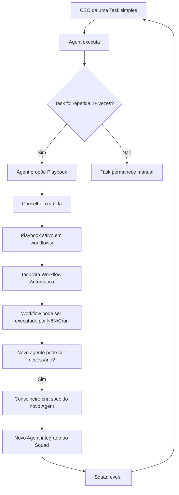

# ⚙️ AIOS — Operations Playbook & Recurring Cadences

> **Complementar a:** `docs/COUNSELOR-KNOWLEDGE-TRANSFER.md`
> **Padrão:** Synkra AIOS v2.1 (Task-First Architecture)
> **Autor:** Conselheiro-Chefe, Entidados AGE
> **Versão:** 1.0 — 2026-02-28

---

## 1. ANATOMIA DE UM SQUAD FORMAL (Padrão AIOS)

Todo Squad segue esta estrutura obrigatória:

```
squads/{squad-name}/
├── squad.yaml              # Manifesto (obrigatório)
├── README.md               # Documentação
├── config/
│   ├── coding-standards.md
│   ├── tech-stack.md
│   └── source-tree.md
├── agents/
│   └── {agent}.md          # Definição de cada agente
├── tasks/
│   └── {task}.md           # Tarefas executáveis (TASK-FORMAT-SPEC-V1)
├── workflows/
│   └── {workflow}.yaml     # Workflows multi-step
├── checklists/
│   └── {checklist}.md      # Validação
├── templates/
│   └── {template}.md       # Templates de documento
├── data/
│   └── {data}.json         # Dados de referência
└── scripts/
    └── {script}.sh         # Scripts de automação
```

O princípio é **Task-First**: `User Request → Task → Agent Execution → Output`

---

## 2. O SISTEMA DE CADÊNCIA (Heartbeat do AIOS)

O AIOS não é um sistema que roda "quando alguém pede". Ele tem um **heartbeat** — um ciclo cardíaco de operações recorrentes que mantém a DAO viva sem intervenção do CEO.

### 2.1 Cadência Diária (Pulso — Todo dia às 09:00)

| # | Task | Squad | Agente | Trigger | Output |
|---|---|---|---|---|---|
| D1 | **Revenue Scan** | Survival | `@analyst` | Script automático (`cron` / N8N) | `raw_opportunities.json` atualizado |
| D2 | **HOT Lead Alert** | Survival | `@sm` | Após D1 | Notificações Mac + `radar_opportunities.json` |
| D3 | **Proposal Drafting** | Survival | `@copywriter` | Após D2 (se HOT > 0) | `proposals/PROPOSAL-*.md` |
| D4 | **Dashboard Sync** | Survival | `@dev` | Após D1 | Dashboard atualizado com novas vagas |
| D5 | **Content Pulse** | Content | `@analyst` | Verificar trending topics | `data/content-ideas.json` |

**Implementação prática:** Um script `daily-heartbeat.sh` que roda via `cron` ou N8N:

```bash
#!/bin/bash
# daily-heartbeat.sh — Executar via crontab: 0 9 * * * /path/to/daily-heartbeat.sh
python3 src/workers/revenue_scraper.py          # D1
python3 scripts/monitor-hot-proposals.py        # D2
# D3: Ativar @copywriter manualmente ou via Claude CLI
# D4: Dashboard auto-atualiza via polling
```

### 2.2 Cadência Semanal (Ritmo — Toda Segunda-feira)

| # | Task | Squad | Agente | Output |
|---|---|---|---|---|
| W1 | **Weekly Revenue Report** | Survival | `@analyst` | Relatório: propostas enviadas, convertidas, pipeline |
| W2 | **Profile Optimization Review** | Survival | `@copywriter` | A/B test de headlines, bio updates |
| W3 | **Content Calendar Update** | Content | `@pm` | Próximos 7 dias de conteúdo planejados |
| W4 | **Tech Debt Assessment** | Product | `@architect` | Priorização de melhorias técnicas |
| W5 | **Cold Outreach Batch** | Survival | `@copywriter` | 5-10 mensagens de prospecção ativa |
| W6 | **AIOS Health Check** | — | Conselheiro | Verificar: todos os scripts rodam? Dados atualizados? |

### 2.3 Cadência Mensal (Respiração — Primeiro dia útil do mês)

| # | Task | Squad | Agente | Output |
|---|---|---|---|---|
| M1 | **Monthly Revenue Dashboard** | Survival | `@analyst` | MRR, propostas, conversão, pipeline completo |
| M2 | **Squad Performance Review** | Todos | Conselheiro | Qual squad gerou mais valor? Realocar recursos? |
| M3 | **Workflow Audit** | — | Conselheiro | Quais workflows estão obsoletos? Novos necessários? |
| M4 | **Agent Evolution** | — | Conselheiro | Novos agentes necessários? Specs desatualizadas? |
| M5 | **Product Pipeline Review** | Product | `@po` | Próximo produto a lançar, kill/keep decisions |
| M6 | **Cert & Profile Refresh** | Survival | `@dev` | Novas certificações, atualizar portfólio |

---

## 3. ATIVAÇÃO DE SQUADS — Protocolo Padrão

### 3.1 Como Ativar um Squad no Claude Code

Cada terminal do Claude Code é um **slot de execução**. O Conselheiro prepara o prompt de ativação.

**Template de Prompt de Ativação:**

```
Claude, atue como @{agent} do Squad {squad-name}.
Leia sua spec em squads/agents/{agent}.md
Leia o workflow em squads/agents/workflows/{workflow}.md
Contexto: {briefing situacional}
Input: {caminho do arquivo de entrada}
Output: {caminho e formato do output esperado}
Comece imediatamente.
```

### 3.2 Mapa de Slots (Terminais Paralelos)

| Slot | Papel Padrão | Quando Ativar | Quando Liberar |
|---|---|---|---|
| T1 | **Conselheiro-Chefe** | Sempre ativo | Nunca |
| T2 | **@dev (Dex)** | Tasks de código, bots, scripts | Quando task completa |
| T3 | **@pm + @dev (UI)** | Dashboard, integrações, N8N | Quando feature completa |
| T4 | **@sm (River) ou @copywriter (Quill)** | Propostas, outreach, monitoramento | Quando batch completa |
| T5+ | **On-demand** | Demandas especiais, sprints | Task-based |

### 3.3 Regra de Prioridade de Alocação (Revenue-First)

```
SE há HOT leads sem proposta → @copywriter PRIMEIRO
SE há proposta sem envio     → CEO revisa e envia
SE há bug na pipeline        → @dev PRIMEIRO
SE nada urgente              → @content ou @product
```

---

## 4. O SISTEMA DE PLAYBOOKS VIVOS

### 4.1 O que é um Playbook?

Um Playbook é um **workflow documentado que pode ser executado por qualquer agente** sem precisar de contexto adicional. É o "DNA" replicável do AIOS.

### 4.2 Tipos de Playbook

| Tipo | Descrição | Originação |
|---|---|---|
| **Playbook Padrão** | Workflow estável que roda regularmente (D1-D5, W1-W6, M1-M6) | Criado pelo Conselheiro |
| **Playbook Emergencial** | Resposta rápida a um evento inesperado (ex: conta banida, servidor caiu) | Criado quando necessário, arquivado depois |
| **Playbook Gerado** | Workflow que foi criado **automaticamente** por um agente que percebeu um padrão | Auto-gerado → Revisado pelo Conselheiro |

### 4.3 O Loop de Auto-Geração de Playbooks

Este é o coração do **Mosaico Infinito**:



**Regra EVAD:** *"Se fez 2x manualmente, automatize na 3ª."*

### 4.4 Formato Padrão de Playbook (Alinhado ao AIOS Task-Format-Spec-V1)

```markdown
---
description: [Descrição curta do playbook]
cadence: daily | weekly | monthly | on-demand
owner_agent: @{agent}
owner_squad: {squad-name}
---
# Playbook: {Nome do Playbook}

## Pré-condições
- [O que precisa estar verdadeiro antes de executar]

## Steps
1. [Passo 1]
2. [Passo 2]
...

## Output Esperado
- [Arquivo ou resultado produzido]

## Validação
- [ ] [Critério de sucesso 1]
- [ ] [Critério de sucesso 2]

## Histórico de Execuções
| Data | Executor | Resultado | Observações |
|---|---|---|---|
```

---

## 5. ESCALABILIDADE — De Squads a Projetos

### 5.1 A Hierarquia do Mosaico Infinito

```
Tasks (ações atômicas)
  └── Workflows (sequência de tasks)
        └── Agents (executores especializados)
              └── Squads (times de agents)
                    └── Projetos (conjuntos de squads)
                          └── Organismos (DAOs autônomas)
```

### 5.2 Quando Criar um Novo Squad

| Sinal | Ação |
|---|---|
| 3+ agentes trabalhando no mesmo domínio de forma ad-hoc | Formalizar como Squad |
| Novo projeto com stack/domínio diferente | Criar Squad dedicado |
| Conselheiro identifica gap recorrente no coverage | Propor novo Squad ao CEO |

### 5.3 Quando Criar um Novo Agent

| Sinal | Ação |
|---|---|
| Task complexa que nenhum agent existente faz bem | Criar spec de novo Agent |
| Playbook recorrente que precisa de persona especializada | Criar Agent Owner do Playbook |
| CEO pede explicitamente | Criar imediatamente |

### 5.4 Quando Criar um Novo Projeto

| Sinal | Ação |
|---|---|
| 2+ Squads precisam de seu próprio repositório | Criar novo Projeto |
| Domínio completamente diferente (ex: SaaS vs Freelance) | Novo Projeto com seu próprio Conselheiro |
| Revenue stream separada que precisa de tracking independente | Spin-off como Projeto |

---

## 6. INVENTÁRIO ATUAL DE SQUADS E AGENTS

### Squads Ativos

| Squad | Órgão | Prioridade | Status |
|---|---|---|---|
| `squad-survival` | NEXUS | 🔥 MÁXIMA | Operacional |
| `squad-content` | SINAL | 🟡 MÉDIA | Planejado |
| `squad-product` | FORGE | 🔵 BAIXA | Planejado |

### Agents Ativos

| Agent | Codinome | Squad Primário | Status |
|---|---|---|---|
| `@dev` | Dex | Survival, Product | ✅ Ativo |
| `@pm` | — | Survival, Product | ✅ Ativo |
| `@sm` | River | Survival | ✅ Ativo |
| `@copywriter` | Quill | Survival, Content | ✅ Criado |
| `@analyst` | Zara | Survival, Content | 📋 Spec pendente |
| `@architect` | Aria | Product | 📋 Spec pendente |
| `@devops` | Felix | Product | 📋 Spec pendente |
| `@po` | Nova | Product | 📋 Spec pendente |
| `@qa` | Quinn | Product | 📋 Spec pendente |

### Playbooks Ativos

| Playbook | Cadência | Owner | Status |
|---|---|---|---|
| Revenue Scan (D1) | Diário | `@analyst` | ✅ Script funcional |
| HOT Lead Alert (D2) | Diário | `@sm` | ✅ Script funcional |
| Proposal Drafting (D3) | Diário | `@copywriter` | ✅ Workflow criado |
| Profile Optimization (W2) | Semanal | `@copywriter` | ✅ Workflow criado |
| Cold Outreach (W5) | Semanal | `@copywriter` | ✅ Workflow criado |

---

## 7. COMO O CONSELHEIRO OPERA O HEARTBEAT

### Checklist Diário do Conselheiro (09:00)

```markdown
- [ ] Verificar se D1 (Revenue Scan) executou → Se não, rodar manualmente
- [ ] Verificar output de D2 (HOT alerts) → Se HOT > 0, ativar @copywriter
- [ ] Verificar se há propostas pendentes de envio pelo CEO
- [ ] Verificar status dos terminais paralelos → Realinhar se necessário
- [ ] Anotar decisões e pivôs no CODEX
```

### Checklist Semanal do Conselheiro (Segunda-feira)

```markdown
- [ ] Consolidar métricas: propostas enviadas, convertidas, revenue
- [ ] Avaliar performance de cada agent ativo
- [ ] Propor novos Playbooks baseado em padrões observados
- [ ] Atualizar prioridades dos Squads (Revenue-first)
- [ ] Sync com CEO: bloqueios, pivôs, novas oportunidades
```

### Checklist Mensal do Conselheiro (Dia 1)

```markdown
- [ ] Monthly Revenue Report completo
- [ ] Squad Performance Review (qual gerou mais valor?)
- [ ] Workflow Audit (quais estão obsoletos?)
- [ ] Agent Evolution (novos agents necessários?)
- [ ] Propor próximo Sprint de Produto (Product Squad)
- [ ] Atualizar COUNSELOR-KNOWLEDGE-TRANSFER se aprendeu algo novo
```

---

> **Este documento é vivo.** Todo novo Playbook criado, todo novo Agent adicionado, todo padrão emergente detectado deve ser refletido aqui. O AIOS não é estático — é um organismo que respira, evolui e se multiplica.
>
> *Ciência. Intuição. Arte. EVAD.*
